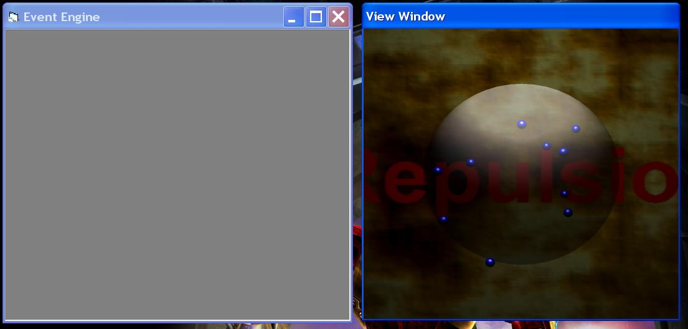



## Electron Simulation

### Description

This simulates the flow of electrons. Please give lots of feedback. This uses a working version of the engine so please try it. Remember to compile all the DLL's and reference them.
 
### More Info
 

             |
---                |---
**Submitted On**   |2002-03-03 03:54:46
**By**             |[The GeForce](https://github.com/Planet-Source-Code/PSCIndex/blob/master/ByAuthor/the-geforce.md)
**Level**          |Advanced
**User Rating**    |4.8 (24 globes from 5 users)
**Compatibility**  |VB 6\.0
**Category**       |[DirectX](https://github.com/Planet-Source-Code/PSCIndex/blob/master/ByCategory/directx__1-44.md)
**World**          |[Visual Basic](https://github.com/Planet-Source-Code/PSCIndex/blob/master/ByWorld/visual-basic.md)
**Archive File**   |[Electron\_S58980332002\.zip](https://github.com/Planet-Source-Code/the-geforce-electron-simulation__1-32284/archive/master.zip)

